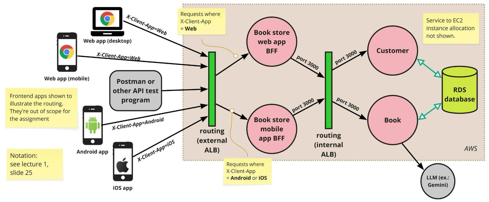
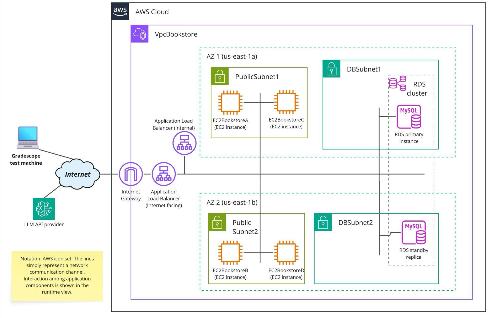

# A2: Bookstore Microservices with BFFs & AWS Deployment

- **Student:** Karan Manoj Shah (kmshah2)
- **Course:** 17-647 Engineering Data-Intensive Scalable Systems

## Overview
- Users see different responses based on the device they use (Web, iOS, Android), using the backends-for-frontends pattern.
- Each individual service (books, customers, each BFF) is packaged and deployed independently, aka, "microservice".
- Auth middleware is setup on the BFFs to verify and validate JWT tokens against given specification.
- AWS deployment uses listener rules to route requests via application load balancers.
- Internal services are isolated from public requests through routing rules.

### Stack
- Rust with Axum and Tokio for the services.
- Services containerized at deployment with Docker to EC2 t3.micro instances.
- RDS Aurora cluster using MySQL for database.
- Hands-free provisioning of AWS infrastructure through CloudFormation.
- Google Gemini 2.5 Flash Lite for fast book summary generation.

## Runtime Architecture Specification

## Deployment Architecture Specification

